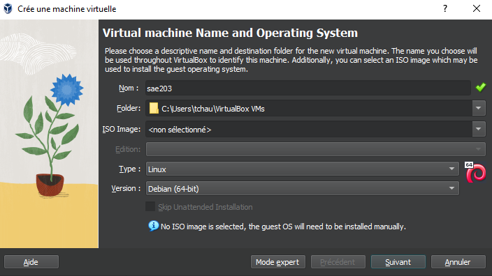
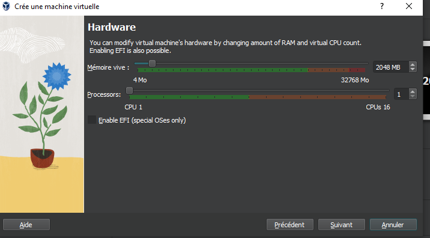
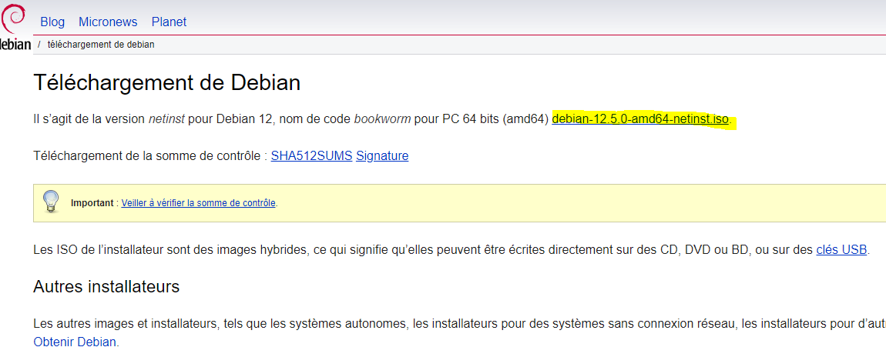

### Création d'un nouvelle marchine virtuelle avec le logiciel Virtual Box  

* Nous avons créé un machine virtuelle grâce au logiciel Virtual Box au quel on lui a donner certaine caratéristique  

* Télécharger le fichier iso de Debian 12  

  > grace au site de [Debian](https://www.debian.org/download) nous avons pu télécharger le fichier iso puis l'insérer dans le lecteur disque de la machine virtuel  

  

* Configuration de la machine  

  > Nom de marchine : serveur
  
  > Langue : Français
  
  > miroir : http://debian.polytech-lille.fr
  
  > Compte administrateur : nom -> root / mot de passe -> root
  
  > Compte utilisateur : nom -> user / mot de passe -> user
  
  > On coche -> environnement de bureau Debian
  
  >          -> Mate
  
  >          -> serveur Web
  
  >          -> serveur ssh
  
  >          -> utilitaire usuels du système
  
  > Et on décoche Gnome  

* Création automatique d'une VM sans interface graphique  
  
  > on recréé une VM avec les mêmes caractéristiques que la précédente.  
  
  > on se déplace dans le répertoire de la VM, puis on décompresse l'archive "autoinstall_Debian.zip".  
  
  > on rentre la commande  

  > `sed -i -E "s/(--iprt-iso-maker-file-marker-bourne-sh).*$/\1=$(cat/proc/sys/kernel/random/uuid)/" S203-Debian12.viso`  
    
  > on met le fichier "S203_Debian12.viso" dans le lecteur CD de la VM, puis on la démare.  

* Problèmes rencontrés  

  > nous n'avons pas rencontrés de problèmes autre que des erreurs d'inattention, comme lors de l'installation des logiciels pendant l'installation de Debian.
