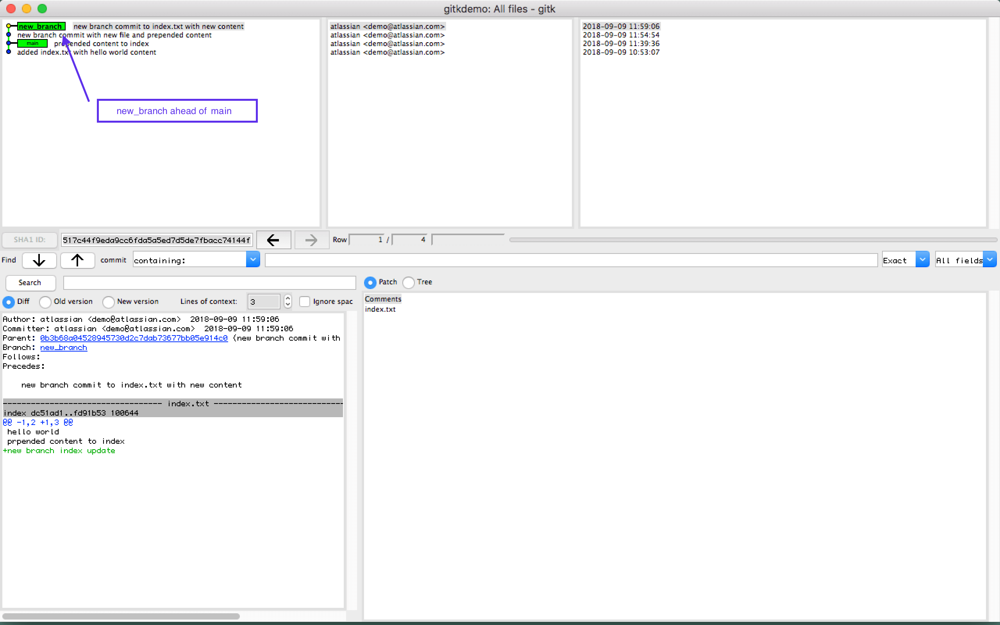
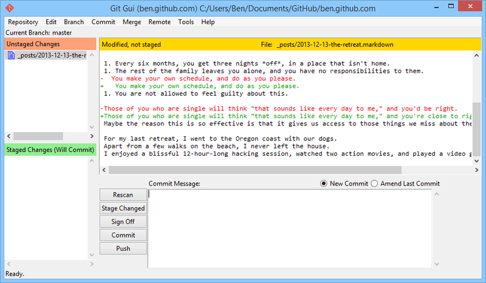
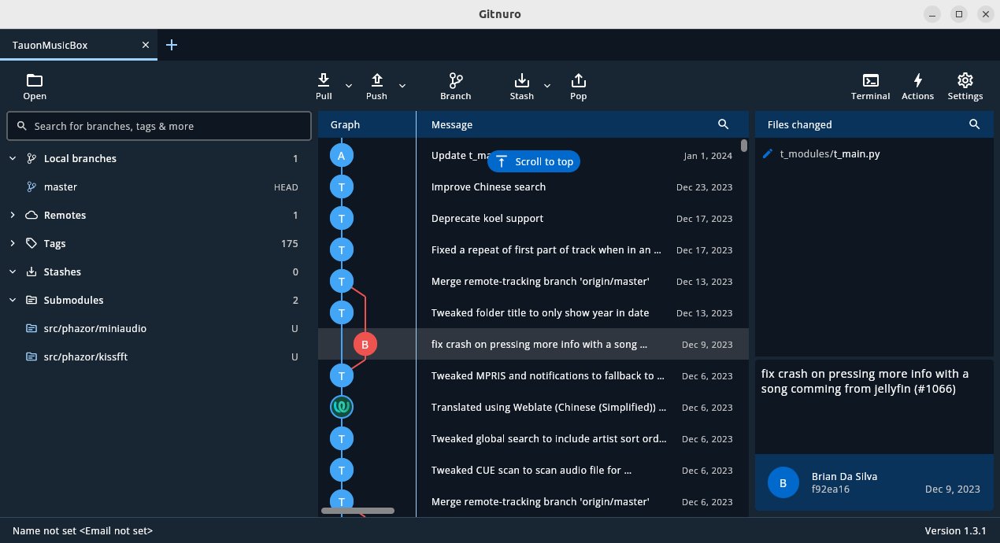

### 1.2. Les interfaces graphiques pour git
* Qu’est-ce que le logiciel gitk ? Comment se lance-t-il ?  

  > gitk est un navigateur de dépôt graphique, le premier de son genre. Il peut être considéré comme un encapsuleur graphique pour git log. Il permet         d'explorer et de visualiser l'historique d'un dépôt.
  
  **Source :** [Atlassian.com](https://www.atlassian.com/fr/git/tutorials/gitk)  

  > Il se lance en rentrant dans un terminal la commande `gitk &`

  &nbsp;
* Qu’est-ce que le logiciel git-gui ? Comment se lance-t-il ?  

  > Git-gui est une interface graphique de Git basée sur Tcl/Tk. git gui permet aux utilisateurs d’apporter des modifications à leur dépôt en faisant de      nouveaux commits, en modifiant les commits existants, en créant des branches, en effectuant des fusions locales, et en récupérant/poussant vers des dépôts distants.

  > Contrairement à gitk, git gui se concentre sur la génération de commit et l’annotation de fichiers uniques et n’affiche pas l’historique du projet.       Il fournit cependant des actions de menu pour démarrer une session gitk à partir de git gui.

  **Source :** [git-scm.com](https://git-scm.com/docs/git-gui/fr)  

  > il se lance en rentrant dans un terminal la commande `git gui &`

  &nbsp;

### 1.3. Installons autre chose et comparons
* Pourquoi avez-vous choisi ce logiciel ?  

  > nous avons premièrement cherché un logiciel avec une interface graphiquqe attirante et simple, puis en avons cherché un qui était totalement gratuit, ce qui qui nous à tourné vers gitnuro
  
  &nbsp;
* Comment l’avez vous installé ?  

  > tout d'abord, il faut ouvrir un terminal, puis installer flatpak
    * `sudo apt install flatpak`

    * `sudo add-apt-repository ppa:flatpak/stable`

    * `sudo apt update`

    * `sudo apt install flatpak`  
&nbsp;  

  > ensuite, on doit ajouter le flathub repository pour avoir accès à la librairie d'application de flathub  

    * `flatpak remote-add --if-not-exists flathub https://dl.flathub.org/repo/flathub.flatpakrepo`  
&nbsp;  

  > ensuite, il faut installer gitnuro depuis la librairie de flathub  

    * `flatpak install flathub com.jetpackduba.Gitnuro`  
&nbsp;   

 &nbsp;
    **Source :** [pour setup flatpak et flathub](https://flathub.org/setup) et [installer gitnuro](https://flathub.org/apps/com.jetpackduba.Gitnuro)
  &nbsp;
  
* Comparer-le aux outils inclus avec git (et installé précédemment) ainsi qu’avec ce qui serait fait
    en ligne de commande pure : fonctionnalités avantages, inconvénients  

  > gitk ne peut que montrer les changements sur un repository, pas le modifier.  
  > git gui ne permet que de faire des modification ou de créer/cloner des repository.  
  > Ils ont cependant l'avantage d'être installé en même temps que git et de pouvoir fonctionner ensemble.
    &nbsp;
  
  > gitkraken permet de voir les modification d'un repository et de le modifier, mais il a très peu de fonctionnalité sur la version gratuit comme l'impossibilité d'acceder au repository privés.
  > La version d'essai ne dure qu'un semaine, cependant la version payante est relativement abordable pour les particuliers et avec des tarifs spéciaux pour groupes et entreprises.
  > De plus cette version payante à beaucoup de fonctionnalitées pratiques comme la génération de clé ssh automatique et des outils pour les travaux de groupe.
     &nbsp;
  
  > gitnuro permet de voir l'historique et de modifier un repository tout en étant totalement gratuit.
  &nbsp;

|                | voir l'historique | modifier/créer des repository | gratuit |
| :---           |       :---:       |             :---:             |  :---:  | 
| gitk           |        [x]        |              [ ]              |   [x]   |
| git gui        |        [ ]        |              [x]              |   [x]   |
| gitkraken      |        [x]        |              [x]              |   [ ]   |
| gitnuro        |        [x]        |              [x]              |   [x]   |
  &nbsp;
