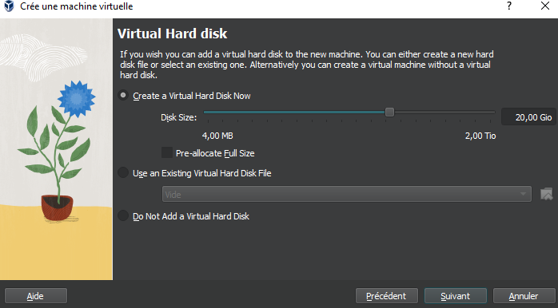
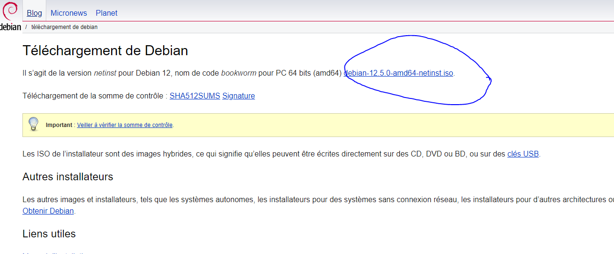
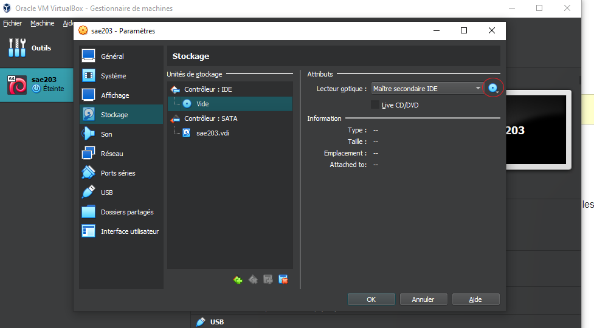

<meta charset="UTF-8">
<link rel="stylesheet" type="text/css" href="style.css">

### SAE 2.03 : RAPPORT SEMAINE 08

STIEVENARD Adam -- CHAUMETTE Thomas -- Leclercq Hugo

***
# table des matières

[Question/réponses](#qr)
  &nbsp;  
[Rapport Technique](#rt)
  &nbsp;  
[GIT](#git)
  &nbsp;  
[GITEA](#gitea)

***
<a name="qr">
Question/réponses
</a>

### Question(s) 1 : Configuration matérielle dans VirtualBox 
* Que signifie “64-bit” dans “Debian 64-bit” ?
    
    > "64-bit" fait référence à **l'architecture du processeur** utilisée par le système d'exploitation Debian.  
    Dans le contexte de "Debian 64-bit", cela signifie que **la version** de Debian est conçue pour fonctionner sur des processeurs 64 bits.  
    Les processeurs 64 bits sont capables de traiter des instructions en blocs de 64 bits à la fois, ce qui peut offrir des performances et une capacité de mémoire supérieures par rapport aux processeurs 32 bits.  
    Ainsi, une version 64 bits de Debian est optimisée pour fonctionner sur des systèmes équipés de processeurs 64 bits, offrant potentiellement des performances améliorées et une meilleure gestion de la mémoire pour les applications et les systèmes qui exigent une grande puissance de calcul ou une grande capacité mémoire.
    
  **Source :** [Lemagit.fr](https://www.lemagit.fr/definition/64-bits)  
  &nbsp;
* Quelle est la configuration réseau utilisée par défaut ?
  > la configuration réseau par défaut **l’Interface NAT**.  
  C'est un processus de modification des adresses IP, des ports source et de destination qui permet aux machines de communiquer avec une seule adresse ip publique.  

  **Source :** [Fortinet.com](https://www.fortinet.com/fr/resources/cyberglossary/network-address-translation)  
  &nbsp;
* Quel est le nom du fichier XML contenant la configuration de votre machine ?  
  > ce fichier s'appelle **sae203.vbox**.
  &nbsp;
* Sauriez-vous le modifier directement ce fichier de configuration pour mettre 2 processeurs à votre machine ?
  &nbsp;  
  &nbsp;  

### Question(s) 2. Installation OS de base 
* Qu’est-ce qu’un fichier iso bootable ?

    > Un fichier ISO bootable est une image disque qui contient l'ensemble des fichiers et des données nécessaires pour installer un système d'exploitation ou un logiciel. Le terme "bootable" signifie que cette image est configurée de manière à ce qu'elle puisse être utilisée pour démarrer un ordinateur directement à partir de cette image, sans avoir besoin d'un système d'exploitation déjà installé.

    **Source :** [Ionos.fr](https://www.ionos.fr/digitalguide/serveur/know-how/quest-ce-quun-fichier-iso/)

  &nbsp;  
* Qu’est-ce que MATE ? GNOME ?

    > MATE et GNOME sont deux environnements de bureau pour les systèmes d'exploitation Linux et Unix, offrant des interfaces graphiques pour interagir avec le système et les applications.
    
    > MATE est un environnement de bureau léger et intuitif qui est un fork de GNOME 2. L'objectif principal de MATE est de fournir une expérience utilisateur familière pour les utilisateurs de Linux, en particulier ceux qui préféraient l'ancien environnement GNOME 2. Il offre une interface utilisateur traditionnelle avec un menu d'applications, une barre des tâches et une gestion des fenêtres classiques. MATE est conçu pour être rapide, stable et hautement personnalisable.
    
    > GNOME est un environnement de bureau moderne et convivial pour les systèmes d'exploitation basés sur Linux et Unix. GNOME met l'accent sur l'ergonomie, l'accessibilité et l'expérience utilisateur. Il propose une interface utilisateur épurée et intuitive avec un lanceur d'applications, un gestionnaire de fichiers intégré et une multitude d'applications intégrées pour les activités quotidiennes telles que la navigation sur le Web, la gestion des courriels et la retouche d'images. GNOME est hautement personnalisable et extensible grâce à des extensions et des thèmes.
 
    **Sources :** [Gnome.org](https://www.gnome.org/) et [mate-desktop.org](https://mate-desktop.org/)  

  &nbsp;  
* Qu’est-ce qu’un serveur web ?  

    > Un serveur web est un logiciel informatique conçu pour recevoir, traiter et répondre aux requêtes HTTP (Hypertext Transfer Protocol) provenant des clients, généralement des navigateurs web, et pour fournir des ressources web, telles que des pages HTML, des images, des fichiers CSS et JavaScript, en réponse à ces requêtes.  
    En termes simples, un serveur web permet de rendre les sites web accessibles sur Internet.

    
  
    **Source :** [Mozilla.org](https://developer.mozilla.org/fr/docs/Learn/Common_questions/Web_mechanics/What_is_a_web_server)  
  &nbsp;  
* Qu’est-ce qu’un serveur ssh ?  

    > Un serveur SSH (Secure Shell) est un logiciel qui permet à un utilisateur de se connecter de manière sécurisée à un ordinateur distant sur un réseau, généralement Internet.  
    Le protocole SSH fourniQu’est-ce que Gitea ?t un moyen crypté et sécurisé pour accéder à des systèmes distants et exécuter des commandes à distance, transférer des fichiers et gérer des systèmes à distance.  

    

    

    **Source :** [It-Connect.fr](https://www.it-connect.fr/chapitres/quest-ce-que-ssh/)

  &nbsp;  
* Qu’est-ce qu’un serveur mandataire ?  

    > Un serveur mandataire, également connu sous le nom de serveur proxy, est un serveur informatique qui agit comme un intermédiaire entre les clients et d'autres serveurs.  
    Son rôle principal est de recevoir les requêtes des clients, telles que des demandes de pages web, des fichiers, ou d'autres ressources, et de les transmettre aux serveurs appropriés.  En retour, il renvoie les réponses des serveurs aux clients.  
    

    **Source :** [Techno-Science.net](https://www.techno-science.net/definition/3812.html)

  &nbsp;
  &nbsp;  

### Question(s) 3. sudo
* Comment peux-ton savoir à quels groupes appartient l'utilisateur user ?  

  > Pour savoir à quels groupes l'utilisateur user appartient, il suffit juste de se connecter en administrateur avec la commade :
  `su -`  
  > Puis mettre de mettre la commande :
  `groups user`  
  > Si l'utilisateur au quel vous êtes connecté possède les droits sudo pas besoins de mettre le mode administrateur, il suffit juste de mettre :
  `sudo groups user`
    
&nbsp;  

### Question(s) 4. Suppléments invités 
* Quel est la version du noyau Linux utilisé par votre VM ? N’oubliez pas, comme pour toutes les questions, de justifier votre réponse.
  mettre 'uname -r' dans le terminal
  &nbsp;
* À quoi servent les suppléments invités ? Donner 2 principales raisons de les installer.  

  > Meilleures performances graphiques : les pilotes graphiques personnalisés qui sont installés avec les additions invité vous offrent de meilleures performances graphiques pour un système plus fluide. Vous pourrez aussi redimensionner la fenêtre de la machine virtuelle, la résolution d’écran de l’invité sera automatiquement ajustée.

  > Dossiers partagés : permet d’échanger des fichiers entre l’hôte et l’invité.

  **Source :** [Lecrabeinfo.net](https://lecrabeinfo.net/virtualbox-installer-les-additions-invite-guest-additions.html)
  &nbsp;
* À quoi sert la commande mount (dans notre cas de figure et dans le cas général) ?  

  > La commande mount permet de demander au système d'exploitation de rendre un système de fichiers accessible, à un emplacement spécifié (le point de montage). La commande mount monte un système de fichiers indiqué comme répertoire à l'aide du paramètre Noeud:Répertoire, sur le répertoire spécifié par le paramètre Répertoire. Une fois la commande mount exécutée, le répertoire indiqué devient le répertoire racine du nouveau système de fichiers monté.

  **Source :** [ibm.com](https://www.ibm.com/docs/fr/power9?topic=commands-mount-command)
  &nbsp;
  
### 4.2. Quelques Questions
* Qu’est-ce que le Projet Debian ? D’où vient le nom Debian ?  

  >Le Projet Debian est une organisation communautaire qui développe le système d'exploitation Debian. Debian est une distribution Linux très populaire, connue pour sa stabilité, sa fiabilité et son engagement envers les principes du logiciel libre. Son nom "Debian" est une fusion des prénoms du fondateur du projet, Ian Murdock, et de celui de son épouse.  

  **Source :** [Debian.org](https://www.debian.org/doc/manuals/project-history/intro.fr.html#:~:text=La%20prononciation%20officielle%20de%20Debian,et%20de%20son%20épouse%2C%20Debra)

    &nbsp;  
  
* Il existe 3 durées de prise en charge (support) de ces versions : la durée minimale, la durée en support long terme (LTS) et la durée en support long terme étendue (ELTS). Quelle sont les durées de ces prises en charge ?  

  > La durée en support long terme (LTS) est de 5ans quand à la durée en support long terme étendue est de 10ans.
  
  **Source :** [Wiki.debian.org](https://wiki.debian.org/fr/LTS/)
  &nbsp; 
* Pendant combien de temps les mises à jour de sécurité seront-elles fournies ?  

  > L'équipe en charge de la sécurité prend en charge la distribution stable pendant trois années après sa publication. Il n'est pas possible de prendre en charge trois distributions, c'est déjà bien assez difficile avec deux.
  

  **Source :** [Debian.org](https://www.debian.org/security/faq.fr.html#lifespan)

    &nbsp; 
* Combien de version au minimum sont activement maintenues par Debian ? Donnez leur nom générique (= les types de distribution).  

  > Debian maintient généralement trois versions en même temps : Stable : C'est la version principale et la plus récente, conçue pour être stable et fiable. C'est la version recommandée pour la plupart des utilisateurs, car elle bénéficie d'un support complet, y compris les mises à jour de sécurité et les correctifs de bogues.
  Testing : Également connue sous le nom de "Testing", cette version est en cours de développement et contient des logiciels plus récents que la version stable, mais elle peut être moins stable car elle est sujette à des changements fréquents. Cette version est destinée aux utilisateurs qui souhaitent accéder aux dernières fonctionnalités et qui sont prêts à accepter un certain niveau de risque.  
  Unstable : Aussi appelée "Unstable" ou "Sid", cette version est le terrain de jeu pour les développeurs Debian. Elle contient les dernières versions de logiciels qui sont en cours de préparation pour inclusion dans la prochaine version stable. Cette version est instable par nature et n'est pas recommandée pour une utilisation en production, mais elle est utile pour les tests et le développement.  

  **Source :** [Debian.org](https://www.debian.org/releases/index.fr.html#:~:text=Debian%20a%20toujours%20au%20moins,%3A%20stable%20%2C%20testing%20et%20unstable%20)

  &nbsp;  
* Chaque distribution majeur possède un nom de code différent. Par exemple, la version majeur actuelle (Debian 12) se nomme bookworm. D’où viennent les noms de code données aux distributions ?
  > Les noms de code donnés aux distributions majeures de Debian (et à de nombreuses autres distributions Linux) sont généralement tirés des noms de personnages du film d'animation « Toy Story » de Pixar. Cela remonte aux premiers jours du projet Debian lorsque Ian Murdock, le fondateur de Debian, a décidé de nommer les versions de manière ludique et amusante. Les développeurs de Debian ont adopté cette tradition et continuent de nommer les versions de Debian d'après les personnages de Toy Story.

  **Source :** [Debian.org](https://www.debian.org/doc/manuals/debian-faq/ftparchives.fr.html)

  &nbsp;  
  
* L’un des atouts de Debian fut le nombre d’architecture (≈ processeurs) officiellement prises en charge. Combien et lesquelles sont prises en charge par la version Bullseye ?  

  > 13 architecture  -> amd64 (64-bit PC)  
    &emsp;&emsp;&emsp;&emsp;&emsp;&emsp;&emsp;&emsp;-> arm64 (ARM 64 bits)  
    &emsp;&emsp;&emsp;&emsp;&emsp;&emsp;&emsp;&emsp;-> armel (ARM Little Endian 32 bits)  
    &emsp;&emsp;&emsp;&emsp;&emsp;&emsp;&emsp;&emsp;-> armhf (ARM Hard Float 32 bits)  
    &emsp;&emsp;&emsp;&emsp;&emsp;&emsp;&emsp;&emsp;-> i386 (PC 32 bits)  
    &emsp;&emsp;&emsp;&emsp;&emsp;&emsp;&emsp;&emsp;-> mips (MIPS (big endian))  
    &emsp;&emsp;&emsp;&emsp;&emsp;&emsp;&emsp;&emsp;-> mips64el (MIPS (little endian))  
    &emsp;&emsp;&emsp;&emsp;&emsp;&emsp;&emsp;&emsp;-> ppc64el (PowerPC 64 bits Little Endian)  
    &emsp;&emsp;&emsp;&emsp;&emsp;&emsp;&emsp;&emsp;-> s390x (IBM System z)  
    &emsp;&emsp;&emsp;&emsp;&emsp;&emsp;&emsp;&emsp;-> riscv64 (RISC-V 64 bits)  
    &emsp;&emsp;&emsp;&emsp;&emsp;&emsp;&emsp;&emsp;-> m68k (Motorola 680x0)  
    &emsp;&emsp;&emsp;&emsp;&emsp;&emsp;&emsp;&emsp;-> alpha (DEC Alpha)  
    &emsp;&emsp;&emsp;&emsp;&emsp;&emsp;&emsp;&emsp;-> hppa (HP PA-RISC)    
    
  &nbsp;  

* Quelle a était le premier nom de code utilisé ?  

  > Le premier nom de code utilisé pour une version de Debian était « Buzz ».  

  **Source :** [Wiki.debian.org](https://wiki.debian.org/fr/DebianBuzz)

    &nbsp;  
  
* Quand a-t-il été annoncé ?  

  > Elle a été annoncé le 17 juin 1996  

  **Source :** [Wiki.debian.org](https://wiki.debian.org/fr/DebianBuzz)

    &nbsp;  

* Quelle était le numéro de version de cette distribution ?  

  > C'est la version 1.1 de Debian.  

  **Source :** [Wiki.debian.org](https://wiki.debian.org/fr/DebianBuzz)

    &nbsp;  
  
* Quel est le dernier nom de code annoncée à ce jour ?  

  > Le dernier nom de code annocée à ce jour est Bookworm

  **Source :** [Debian.org](https://www.debian.org/releases/index.fr.html#:~:text=Actuellement%2C%20la%20distribution%20stable%20de,publiée%20le%2010%20février%202024.)
  
  &nbsp;  
* Quand a-t-il été annoncé ?  

  > Elle à été publié 10 juin 2023

  **Source :** [Debian.org](https://www.debian.org/releases/index.fr.html#:~:text=Actuellement%2C%20la%20distribution%20stable%20de,publiée%20le%2010%20février%202024.)
  
  &nbsp;  
* Quelle est la version de cette distribution ?  

  > Elle possède la version 12, sa dernière version est le 12.5 en février 2024

   **Source :** [Debian.org](https://www.debian.org/releases/index.fr.html#:~:text=Actuellement%2C%20la%20distribution%20stable%20de,publiée%20le%2010%20février%202024.)
  
  &nbsp;
  
### Question(s) 5. Ajustement de la pré-configuration
* Ajouter le droit d’utiliser sudo à l’utilisateur standard  

  > `su -`

  >`usermod -aG sudo utilisateur`  
  &nbsp;  
* Installer l’environnement MATE  

  > `su -`

  >`tasksel`
  
  > Puis cocher la case MATE et appliquer 
  &nbsp;  
* Ajouter les paquets suivants :  

     1. sudo : sinon la gestion sudo est inutile  

        > `su -`

        >`apt install sudo`  
     3. git, sqlite3, curl : pour préparer l’installation de la semaine prochaine  

        > `su -`

        >`apt install git`

        >`apt install sqlite3`

        >`apt install curl`  
     5. bash-completion : va vous simplifier grandement l’écriture des lignes de commande  

        > `su -`

        >`apt install bash-completion` 
     7. neofetch : pas très utile mais c’est un classique dans son genre (essayez-le)  

        > `su -`

        >`apt install neofetch`  
        
***
<a name="rt">  
Rapport Technique  
</a>    

### Création d'un nouvelle marchine virtuelle avec le logiciel Virtual Box  

* Nous avons créé un machine virtuelle grâce au logiciel Virtual Box au quel on lui a donner certaine caratéristique  

* Télécharger le fichier iso de Debian 12  

  > grace au site de [Debian](https://www.debian.org/download) nous avons pu télécharger le fichier iso puis l'insérer dans le lecteur disque de la machine virtuel  

  

* Configuration de la machine  

  > Nom de marchine : serveur
  
  > Langue : Français
  
  > miroir : http://debian.polytech-lille.fr
  
  > Compte administrateur : nom -> root / mot de passe -> root
  
  > Compte utilisateur : nom -> user / mot de passe -> user
  
  > On coche -> environnement de bureau Debian
  
  >          -> Mate
  
  >          -> serveur Web
  
  >          -> serveur ssh
  
  >          -> utilitaire usuels du système
  
  > Et on décoche Gnome  

* Création automatique d'une VM sans interface graphique  
  
  > on recréé une VM avec les mêmes caractéristiques que la précédente.  
  
  > on se déplace dans le répertoire de la VM, puis on décompresse l'archive "autoinstall_Debian.zip".  
  
  > on rentre la commande  

  > `sed -i -E "s/(--iprt-iso-maker-file-marker-bourne-sh).*$/\1=$(cat/proc/sys/kernel/random/uuid)/" S203-Debian12.viso`  
    
  > on met le fichier "S203_Debian12.viso" dans le lecteur CD de la VM, puis on la démare.  

* Problèmes rencontrés  

  > nous n'avons pas rencontrés de problèmes autre que des erreurs d'inattention, comme lors de l'installation des logiciels pendant l'installation de Debian.
  
***
<a name="git">
GIT
</a>

### 1.2. Les interfaces graphiques pour git
* Qu’est-ce que le logiciel gitk ? Comment se lance-t-il ?  

  > gitk est un navigateur de dépôt graphique, le premier de son genre. Il peut être considéré comme un encapsuleur graphique pour git log. Il permet         d'explorer et de visualiser l'historique d'un dépôt.
  
  **Source :** [Atlassian.com](https://www.atlassian.com/fr/git/tutorials/gitk)  

  > Il se lance en rentrant dans un terminal la commande `gitk &`
  
  &nbsp;
* Qu’est-ce que le logiciel git-gui ? Comment se lance-t-il ?  

  > Git-gui est une interface graphique de Git basée sur Tcl/Tk. git gui permet aux utilisateurs d’apporter des modifications à leur dépôt en faisant de      nouveaux commits, en modifiant les commits existants, en créant des branches, en effectuant des fusions locales, et en récupérant/poussant vers des       dépôts distants.

  > Contrairement à gitk, git gui se concentre sur la génération de commit et l’annotation de fichiers uniques et n’affiche pas l’historique du projet.       Il fournit cependant des actions de menu pour démarrer une session gitk à partir de git gui.

  **Source :** [git-scm.com](https://git-scm.com/docs/git-gui/fr)  

  > il se lance en rentrant dans un terminal la commande `git gui &`
  
  &nbsp;

### 1.3. Installons autre chose et comparons
* Pourquoi avez-vous choisi ce logiciel ?  

  > nous avons premièrement cherché un logiciel avec une interface graphiquqe attirante et simple, puis en avons cherché un qui était totalement gratuit, ce qui qui nous à tourné vers gitnuro
  
  &nbsp;
* Comment l’avez vous installé ?  

  > tout d'abord, il faut ouvrir un terminal, puis installer flatpak
    * `sudo apt install flatpak`

    * `sudo add-apt-repository ppa:flatpak/stable`

    * `sudo apt update`

    * `sudo apt install flatpak`  
&nbsp;  

  > ensuite, on doit ajouter le flathub repository pour avoir accès à la librairie d'application de flathub  

    * `flatpak remote-add --if-not-exists flathub https://dl.flathub.org/repo/flathub.flatpakrepo`  
&nbsp;  

  > ensuite, il faut installer gitnuro depuis la librairie de flathub  

    * `flatpak install flathub com.jetpackduba.Gitnuro`  
&nbsp;   

    **Source :** [pour setup flatpak et flathub](https://flathub.org/setup) et [installer gitnuro](https://flathub.org/apps/com.jetpackduba.Gitnuro)
  &nbsp;
  
* Comparer-le aux outils inclus avec git (et installé précédemment) ainsi qu’avec ce qui serait fait
    en ligne de commande pure : fonctionnalités avantages, inconvénients  

  > gitk ne peut que montrer les changements sur un repository, pas le modifier.  
  > git gui ne permet que de faire des modification ou de créer/cloner des repository.  
  > Ils ont cependant l'avantage d'être installé en même temps que git et de pouvoir fonctionner ensemble.
    &nbsp;
  
  > gitkraken permet de voir les modification d'un repository et de le modifier, mais il a très peu de fonctionnalité sur la version gratuit comme l'impossibilité d'acceder au repository privés.
  > La version d'essai ne dure qu'un semaine, cependant la version payante est relativement abordable pour les particuliers et avec des tarifs spéciaux pour groupes et entreprises.
  > De plus cette version payante à beaucoup de fonctionnalitées pratiques comme la génération de clé ssh automatique et des outils pour les travaux de groupe.
     &nbsp;
  
  > gitnuro permet de voir l'historique et de modifier un repository tout en étant totalement gratuit.
  &nbsp;

|                | voir l'historique | modifier/créer des repository | gratuit |
| :---           |       :---:       |             :---:             |  :---:  | 
| gitk           |        [x]        |              [ ]              |   [x]   |
| git gui        |        [ ]        |              [x]              |   [x]   |
| gitkraken      |        [x]        |              [x]              |   [ ]   |
| gitnuro        |        [x]        |              [x]              |   [x]   |
  &nbsp;
***

<a name="gitea">
  
### Gitea 
</a>

### 2.1. Installons de Gitea
  * Qu’est-ce que Gitea ?
    > Gitea est git gui libre, gratuit et open-source écrit en Go (un language de programmation dévellopé par google et inspiré de C et Pascal) sous licence MIT.
    > il comporte :
    > 1. un système de suivi des bugs
    > 2. un wiki, ainsi que des outils pour la relecture de code
    > 3. un système d'extension, fournissant notamment de l'intégration continue ainsi que de la livraison continue.  
    > &nbsp;

    > Sa première version est sortie le 17 octobre 2016 et est toujours mis à jour régulièrement.  
    > Il est dévellopé par Jiahua Chen et Lunny Xiao et est disponible sur Windows, Mac et Linux.
    > Leur travail est déposé dans [ce repository](https://github.com/go-gitea/gitea).  
    > &nbsp;  

    > **Source :** [gitea.com](https://about.gitea.com/) et [wikipedia.org](https://fr.wikipedia.org/wiki/Gitea)  
    
      &nbsp; 
* À quels logiciels bien connus dans ce domaine peut-on le comparer (en citer au moins 2) ?
  > Dans ce même domaine on peut le comparer à GitHub et GitLab.

  *Source :* [gitea.com](https://docs.gitea.com/next/)  
&nbsp;
### 2.1. Installons de Gitea
* Opération faite
  > test
&nbsp;
### 2.1.2. Mise à jour du binaire du service Gitea
* Quelle version du binaire avez-vous installé ? Donnez la version et la commande permettant d’obtenir cette information.
  > test
&nbsp;
* Comment faire pour mettre à jour le binaire de votre service sans devoir tout reconfigurer ? Essayez en mettant à jour vers la version 1.22-dev.
  > test
&nbsp;
